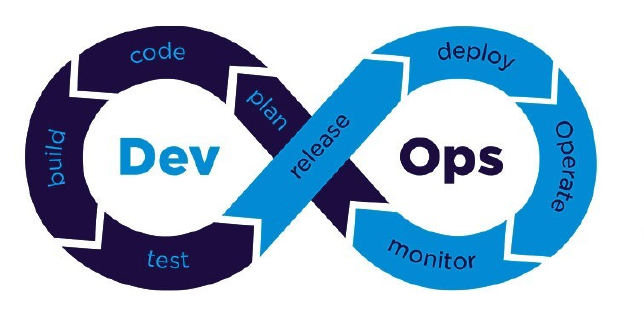
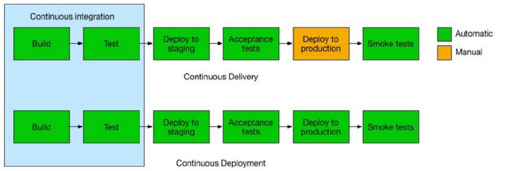

# Summary DevOps

## 1. What is DevOps?

Practice of operations and development engineers participating *together* in the entire service lifecycle from design through development to production support. Whit the goal of improving and shortening the systems development lifecycle.

### Traditional development teams (before DevOps)

- Development teams
  - Requirement analysis
  - Software design
  - Planning
  - Software implementation
  - Testing
- Operation teams
  - Receives application from dev team
  - Deploy app on infrastructure
  - Manage infrastructure
  - Monitoring
  - Support

This approach led to a lot of *operation mismatch*:

- Defects released to production
- Hard to diagnose issues quickly
- Finger pointing
- ...

### DevOps core values

1. Culture and People > Process and tools
    - Poeple become product owners, give them trust and responsibility
2. Automation (infrastructure as code)
    - Automation is critical as things need to move fast
3. Measurement (measure everything)
    - Knowledge of system is key
    - Know when and why things go wrong
4. Sharing - collaboration - feedback
    - Sharing knowledge between Devs and Ops

### Continuous delivery/deployment

- **Continuous integration**: build and test
- **Continuous delivery**: deploy and integration test
- **Continuous deployment**: build, test, deploy, integration test and deploy to prod

> 💡: Best practices
>
> - Build should pass within 5 min (☕ coffee test)
> - Commit small bits
> - Do not leave build broken
> - Deployment should go to a copy of production (🚧 staging) before production

#### Automated testing for continuous deployment

- Unit tests: Test individual components of code
- Integration tests: Test how components work together
- Crossbrowser, performance, security tests

### CI/CD Tooling

- **Version control**: Git, BitBucket
- **CI systems**: Jenkins, TravisCI 
- **Build**: Make, Maven, Packer
- **Test**: Junit, Cucumber
- **Artifact repository**: Dockerhub, Artifactory
- **Deployment**: Ansible

### Reliablility Engineering

The goal is to have no down-time, design patterns exist for creating resilient systems.

The key is to: Build - Measure - Learn - Repeat!

#### Chaos Engineering

Chaos Engineering is a discipline that aims to proactively test and improve a system's resilience to unexpected and turbulent conditions. It involves deliberately introducing controlled and planned disruptions into a software or system environment to observe how the system responds under stress.

**Chaos monkey**
: Introduce random failures in production and see how resilient system is, or how fast ingeneers can act upon this problem.

### DevSecOps

Extension of DevOps that includes security from the get-go

- **Secure Coding**: Responsibility of the devs to write secure code.
- **Security testing tools integrated in CI/CD pipeline**: eg. scanning dependencies/containers for vulnerabilities
- **Shift-left testing**: Software testing is pefromed earlier in lifecycle.

#### Tools to implement DevSecOps

- **SAST - Static Applicaiton Security Testing**
  - Scan proprietary/custom code for erros
  - During the code, build and dev phases of the lifecycle
- **SCA - Software Component Analysis**
  - Scan source code and libraries for known vulnerabilities
  - Provide insight of security and licence risks
  - Integrates seamlessly into CI/CD pipeline
- **IAST - Interactive Application Security Testing**
  - Work in the background during tests to analyze runtime behavior
  - Observe request/response integration
  - Detect runtime vulnerabilities
- **DAST - Dynamic Application Security Testing**
  - Automated black box testing -> mimic how hacker would approach your system

