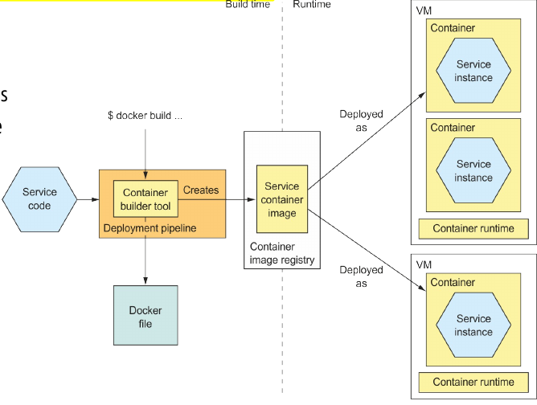
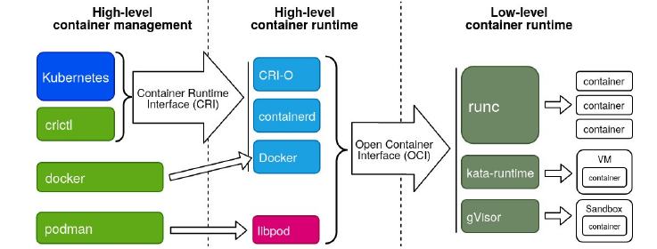
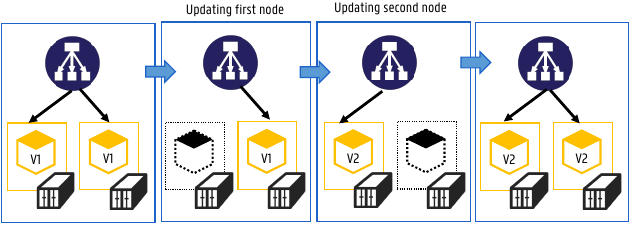
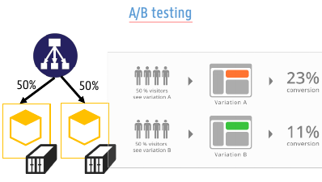
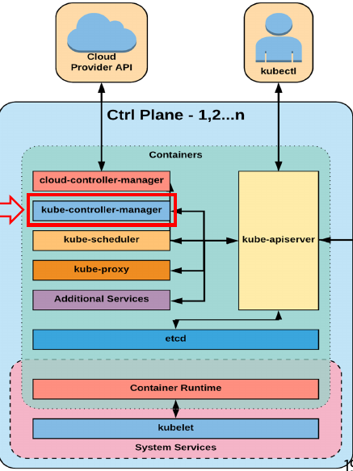
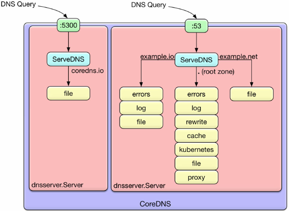
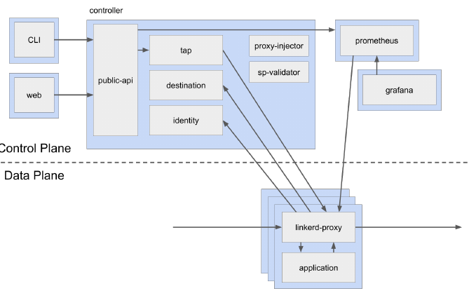
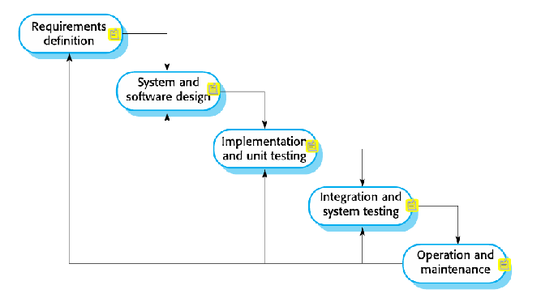
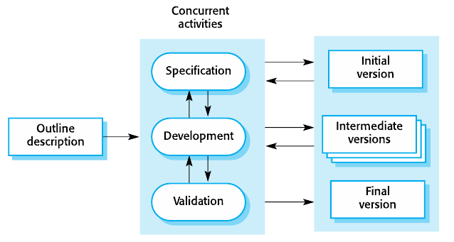
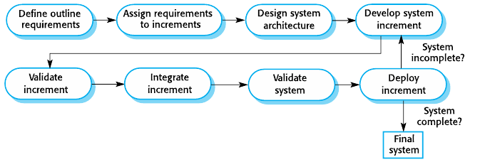

# Summary DevOps

## 1. What is DevOps?

Practice of operations and development engineers participating *together* in the entire service lifecycle from design through development to production support. Whit the goal of improving and shortening the systems development lifecycle.


### Traditional development teams (before DevOps)

- Development teams
  - Requirement analysis
  - Software design
  - Planning
  - Software implementation
  - Testing
- Operation teams
  - Receives application from dev team
  - Deploy app on infrastructure
  - Manage infrastructure
  - Monitoring
  - Support

This approach led to a lot of *operation mismatch*:

- Defects released to production
- Hard to diagnose issues quickly
- Finger pointing
- ...

### DevOps core values

1. Culture and People > Process and tools
    - Poeple become product owners, give them trust and responsibility
2. Automation (infrastructure as code)
    - Automation is critical as things need to move fast
3. Measurement (measure everything)
    - Knowledge of system is key
    - Know when and why things go wrong
4. Sharing - collaboration - feedback
    - Sharing knowledge between Devs and Ops

### Continuous delivery/deployment

- **Continuous integration**: build and test
- **Continuous delivery**: deploy and integration test
- **Continuous deployment**: build, test, deploy, integration test and deploy to prod

> 💡: Best practices
>
> - Build should pass within 5 min (☕ coffee test)
> - Commit small bits
> - Do not leave build broken
> - Deployment should go to a copy of production (🚧 staging) before production


#### Automated testing for continuous deployment

- Unit tests: Test individual components of code
- Integration tests: Test how components work together
- Crossbrowser, performance, security tests

### CI/CD Tooling

- **Version control**: Git, BitBucket
- **CI systems**: Jenkins, TravisCI
- **Build**: Make, Maven, Packer
- **Test**: Junit, Cucumber
- **Artifact repository**: Dockerhub, Artifactory
- **Deployment**: Ansible

### Reliablility Engineering

The goal is to have no down-time, design patterns exist for creating resilient systems.

The key is to: Build - Measure - Learn - Repeat!

#### Chaos Engineering

Chaos Engineering is a discipline that aims to proactively test and improve a system's resilience to unexpected and turbulent conditions. It involves deliberately introducing controlled and planned disruptions into a software or system environment to observe how the system responds under stress.

**Chaos monkey**
: Introduce random failures in production and see how resilient system is, or how fast ingeneers can act upon this problem.

### DevSecOps

Extension of DevOps that includes security from the get-go

- **Secure Coding**: Responsibility of the devs to write secure code.
- **Security testing tools integrated in CI/CD pipeline**: eg. scanning dependencies/containers for vulnerabilities
- **Shift-left testing**: Software testing is pefromed earlier in lifecycle.

#### Tools to implement DevSecOps

- **SAST - Static Applicaiton Security Testing**
  - Scan proprietary/custom code for erros
  - During the code, build and dev phases of the lifecycle
- **SCA - Software Component Analysis**
  - Scan source code and libraries for known vulnerabilities
  - Provide insight of security and licence risks
  - Integrates seamlessly into CI/CD pipeline
- **IAST - Interactive Application Security Testing**
  - Work in the background during tests to analyze runtime behavior
  - Observe request/response integration
  - Detect runtime vulnerabilities
- **DAST - Dynamic Application Security Testing**
  - Automated black box testing -> mimic how hacker would approach your system

## 2. Container Technology

### 2.1 Virualisatoin: VM's and containers

**Why is there a need to containerize testing and deployment?**

- Operation teams must set-up a variety of different runtime engines, deal with versionning, ...
- No ability to constrain resources consumed by a single service instance
- Lack of isolation between multiple instances on the same machine

#### Virtual Machine Images

- ✅: Encapsulation and isolation
- ✅: Virtual hardware
- ❌: Less efficient resource utilization
- ❌: Slow deployments

#### Host Virtualization: Vurtual Machines and Containers

**Hardware virtualization**
: Hypervisor arbitrates access to shared hardware. VM's are completely isolated, each VM requires its own  OS


**Sofware virtualization**
: OS kernel allows multiple process spaces. Containers share the host OS kernel, each container has its own root file system.


#### Container as deployable artifact



- Encapsulation
- Isolation
- Resource contraints
- No virt hardware
- lightweight
- fast boot

### 2.2 Container Technologies

#### LXC/LXD

**LXC**:
Containers build into the Linux kernel. Low-level and difficult to configure.

**LXD**:
Next generation, build on top of LXC, locked in the Canonical ecosystem.

#### Docker

- Can be thought of as a software logistics provider tool (installing, removeing, upgrading and running software)
- Docker CLI + Deamon
  - Builds images, runs and manages containers + REST API
  - Containers can only access their own memory and resources


Container = software that has to get started

Container-image = All the configuration necessary to start the container

##### Handling application dependencies

Without containers, application use the same dependencies (the ones located on the host computer). This can become problematic if different applications require different versions of the dependencies.

When using docker, every container will have it's own copy of the required dependencies.

##### Namespaces / Environment independence

- Every running program or container has a unique *PID*
- PID namespace is set of unique numbers that identify processes
  - Host can have multiple PID namespaces
  - Each PID namespace contains its own PID's
  - Docker created new PID namespace for each container
- Docker provides **environment independence**
  - Within docker, you can run everything independent of other processes on the computer (eg: you don't have to care about existing PID's or other open ports on system)

##### Environment-Agnostic

1. Read-only file systems
    - Attacker can not compromise files in the container
    - Confidence container will not change after changes to the files it contains
2. Environment variable injection
    - Docker `env` command can be used to inject variables (like credentials) into the container
3. Volumes

##### Container states


##### OS layers in containers

**Why is there an OS-layer in a docker container**
: Containers contain a very minimalistic version of an OS. This layer is called the `Base Layer`. This layer contains essentials to run the application (like a file system, network, ...). Developers can choose which Base they want (centos, busybox, scratch, ...)

Windows hosts can also have an additional layer for a hypervisor, in this case, every container receives its own Hyper-V kernel.


> 💡: Containers with Hyper-V are also a bit safer. When an attacker gets access to the kernel, it will only access the virtual Hyper-V kernel.

##### Building container with Dockerfile

Containers can be made using a `Dockerfile` configuration file

```txt
FROM ubuntu:14.04       // Base image

COPY html /var/www/html // Copy files from host to container
ADD web-page-config.tar // Similar to COPY bur for tar and remote URL

ENV APACHE_LOG_DIR /var/log/apahce    // Set env varialbe
USER 73                 // Set userid in the image

EXPOSE 7373/udp 8080    // Expose network ports

RUN apt update -y       // Run bash command
ENTRYPOINT ["echo", "Dockerfile demo"]  // Run when container starts
```

##### Container vs Image

When starting a container from an image, Docker engine will add another layer. This layer will store information added to the container while it was running. If container gets restarted this information will be gone again.

##### Union file system

Some layers in a docker image (like the base layers) have their own read-only file-system. On top of that, Docker Engine adds another read-write file-system when building the container. These different layers get merged into one virtual layer (= **UnionFS**).


**Copy-on-write**
: Only copy file to upper layer that have been modified, this reduces space and startup time.

### 2.3 Container Management/Orchestration

**What does an orchestration framework do?**

It automates deployment, interconnection, scaling and maintenance of multiple containers on a cluster of nodes.

Some container orchestration systems:

- Kubernetes
- Docker orchestration
- Amazon EC2

### 2.4 Container Ecosystem Discussion

#### Low-level

- **Low-level runtime**:
  - Can: spin up a container and connect it to existing network
  - Can't: create network, manage images, prepare environment for container and manage local/persistent storage

- Main approaches (OCI runtime-spec compatible)
  - runc: cli tools for spanning and running OS-level virt container
  - kata-runtime: cli tool for spanning hardare-virt container (focus: security)

#### High-level runtime

**High-level runtime**: deals with creating the network, managing images, perparing environment, and managing local/persistent storage

- Main approaches (CRI-compatible)
  - Containerd: controlled by CNCF
  - CRI-O: bridge between Kubernetes and OCI-compliant runtimes by RedHat (default in OpenShift)
  - Docker

#### High-level management

**High-level container management**: deals with orchestrating containers on infrastructure

- Main approaches:
  - Kubernetes (*de-facto*)
  - Docker
  - Podman (RedHat)



#### Conclusion

- Container: go-to for micro-services
  - Rapid scaling
  - lightweight
  - Can run anywhere
- Container tech options
  - Dockerfiles
  - Docker compose
- Container orchestration
  - Kubernetes is the de-facto standard
- Fractured ecosystem

---

## 3. Kubernetes

**Kubernetes**
: Orchestration technology that abstracts the underlying hardware of the nodes and provides a uniform interface for workload to be deployed and to consume the shared resource pool.

> 💡: Kubernetes works **declarative** -> you declare what you want and kubernetes figures out the steps to get there

### 3.1 Decoupled infrastructure and scaling

- All services within kubernetes are **load balanced** -> easy to upscale
- **Self-healing** and seamless upgrades and rollbacks
- Auto schedule pods based on their resource needs
- Autoscale workloads: makes more instances of container if needed
- Blue/green deployment: runs two environments at once.
  - Blue: live environment
  - Green: Once new software is ready, switch traffic to green, and blue becomes idle.
- Fire off jobs and schedules cronjobs (eg. auto remove n-elements from log file after n minutes)
- Manage stateless and stateful apps
- ! use the same API across bare metal and every cloud provider

### 3.2 Kubernetes Key Concepts

#### Pods

- Smallest unit of work of Kubernetes
- Pods can contain one or more containers, they share volumes, network, namespace and are part of a single context.
- Serve as a unit of deployment, horizontal scaling and replication
  - Pods should remain small, usually a main containers per pod plus required sidecar containers
- Are REST objects
- Are Ephemeral (they can be destroyed anytime and not have fixed network addresses)
- Can have labels, specifying attributes meaningful to user


#### Services

- Abstraction which defines a logical set of pods and a policy by which to access them
- Durable resource (no dynamic startups and shutdowns)
  - Static cluster IP
  - static namespaced DNS name
- Services are also REST objects
- Services is an internal load balancer to pods


**Service registry**
: Database of services, their instances and their locations. Instances are registered on startup and removed on shutdown.

##### Zero-downtime upgrade techniques

1. **Rolling update**
    - 

2. **Canary release**: Have a small numbers of users test the new version
    - 

3. **A/B testing**: Users randomly get a version, collect business metrics (rather than technical testing)
    - 

### 3.3 Kubernetes Architecture


#### Control Plane



##### Kube-controller-manager

- Primary service/daemon that manages all core component control groups
- Monitors the cluster state via API server
- Steer cluster to desired state

##### Kube-scheduler

- Policy-rich engine, tries to place workload on matching resource
  - Decides which nodes should run which pods
- Select node for pods to run on
- Workload requirements example
  - labels
  - Affinity/anti-affinity (which services should be grouped)
  - HW requirements

##### Cloud-Control-Manager

- Daemon that provides cloud-provider specific integration into kubernetes core loop
- Controllers inside cloud-control-manager
  - Node controller: created new Node objects when new servers are created
  - Route controller: configures routes in the cloud
  - Service controller: integration with load balancers, IP address assignment, health checks

#### Node

**Node**
: component of the cluster that serves as a worker machine. It can be either a physical machine or a virtual machine and is responsible for running applications, handling containerized workloads, and providing resources necessary for running those workloads


##### Kubelets 

- Node agent responsible for managing the lifecycle of every pod on its host
- Registers node with API server
- Kubelet interprets YAML pod manifest

##### Container Runtime Engine

- CRI (Container Runtime Interface) compatible application that executes ans manages containers
- Supports different container runtimes (Docker, Kata, Containerd, ...)

##### Kube-proxy

- Manages the network rules on each node
- Performs connection forwarding or load balancing for Kubernetes services

---

## 4. Cloud Native Computing Foundation (CNCF)

- A Linux Foundation project
- Goal: help advance container technology and align industry
- Organizes conferences
- Provide kubernetes certifications and education programs

### 4.1 Scheduling & Orchestration: Kubernetes

CNCF graduated project -> see chapter: [3. Kubernetes](#kubernetes)

### 4.2 Application definition & image build: HELM

- CLI package manager for K8s allowing devs to more easily configure and deploy packages onto K8s
- Helm is **Day 1** operator (deployment)
  - Install or upgrade software deps
  - Configure software deployment
  - Fetch software packages from repo
- K8s is **Day 2** operator (management tasks): monitoring and making backups of stateful/complex workloads
  - eg. Postgres, Kafka, Cassandra


Helm or K8s operator?

- Just installing application -> Helm
- How much customization is needed?
  - Default config -> Helm
  - Special config -> operator
- How mature is cluster?
  - First setup: Helm
  - Advanced: Operator

### 4.3 Database: Vitess and TIKV

### 4.4 Coordiantion & service discovery: CoreDNS & ETCD

#### CoreDNS

Cloud native, authoritative DNS server written in Go. It has a  flexible and plugin-based, extensible request pipeline. So it becomes easy to perform tasks like logging, caching and collecting metric about the DNS server.



### 4.5 Service Proxy: Envoy

Cloud native edge and service proxy.

### 4.6 Service Mesh: Linkerd

**Service Mesh**
: Makes running services easier and safer by giving you runtime debugging, observability, reliability, and security.

Three basic components:

1. UI
2. Data plane: Transparent proxies that run next to each service instance (handles traffic from and to service)
3. control plane: set of services providing aggregation of telemetry data and control data to the data plane proxies

Linkerd exports Prometheus and Grafana dashboards.



### 4.7 Cloud native storage: Rook

Rook turns distributed storage systems into self-managing, self-scaling, self-healing storage services. It automates tasks of a storage administrator.

### 4.8 Container registry: Harbor

Open source registry that secures artifacts with policies and role-based access control,
ensures images are scanned and free from vulnerabilities, and signs images as trusted

### 4.9 Observability & analysis: Prometheus, Jaeger, Fluentd

**Prometheus**
: Metrics-based monitoring and alerting stack (all levels of the stack)

**Jaeger**
: End-to-end distributed tracing: Monitoring and troubleshooting transactions in complex distributed systems.

---

## 5. Software development models

**Software dev model**
: Structured set of activities required to develop a software system.

They involve:

- **Specification**: defining what the system should do
- **Design and implementation**: Define the organization of the system and implementing it
- **Validation**: Checking if it does what the customer wants
- **Evolution**: changing the system in response to changing customer needs

**Plan-driven process**
: Precesses where all activities are planned in advance and progress is measured against plan

**Agile process**
: Planning is incremental and it is easier to change the process to reflect changing customer requirements

### 5.1 Software Development Models

#### Waterfall model

Plan-driven model, separate and distinct phases of specification development.



Phases:

1. **Requirement definition**: eg. What is the budget? Must it work in the Cloud?
2. **System and software design**: eg. making UML diagram
3. **Implementation and unit testing**
4. **Integration and system testing**: Do the different components work with each other?
5. **Operation and maintenance**: maintain the system, include maintenance costs in budget!

- ❌: Difficult to accommodate change after process is underway
  - Only use when requirements are well-understood
- ❌: A phase has to be complete before moving on to next phase
- ✅: When requirements are well defined, this model is typically faster

#### Incremental development



- ✅: Cost of accommodating changing customer requirements is reduced
  - Less rewriting of analysis and documentation
- ✅: easier to get customer feedback on work that has been done
- ✅: More rapid delivery and deployment of *userful* software is possible
  - Customer can have an earlier functioning app that still lacks some less important features.
- ❌: progress is less visible
- ❌: System structure tends to degrade as new increments are added
  - Different features may not be designed to work together from the get-go

#### Reuse-oriented development

System that is mostly made from existing components or COTS (Commercial-off-the-shelf) systems.


Key phases:

- Requirement specification
- Software discovery and evaluation: eval -> check if software does what is advertised
- Requirement refinement: negotiate with customer, see if potential shortcomings are acceptable.
- Application system configuration
- Component adaption and integration

- ✅: Reduced cost
- ✅: Reduced risk
- ✅: Fast delivery and deployment
- ❌: Requirement compromises are common
- ❌: Loss of control over evolution of reused system

### 5.2 Coping with changes

Changes are inevitable in large software projects. Changes lead to rework, so cost of change is dictated by cost of rework and cost of implementing new functionality.

#### Reducing cost of rework

- **Change avoidance**: anticipate changes in software process (eg. Develop prototype to show key-features to customer)
- **Change tolerance**: process is designed so that changes can be implemented at low cost (eg. incremental development)

#### Software prototyping

Initial version of system to demonstrate concepts and try out design options.

- ✅: Improve system usability
- ✅: Closer match to users needs
- ✅: Reduced development effort


> ⚠️: Prototypes should be discarded after development, they don't form a good basis for the final system.

#### Incremental delivery

- Rather than delivering one final product, deliver in broken down increments.
- Implement highest priorities first
- Once development of increment starts, requirements are frozen, though requirements for later increments can continue to evolve.



- ✅: Customer value can be delivered with each increment -> available earlier
- ✅: Earlier increment can function as prototype -> help elicit additional requirements
- ✅: Low risk of project failure
- ❌: Most parts of the system require set of basic functionality (big increments needed in the beginning)

---

