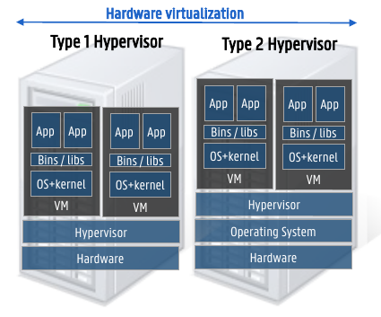
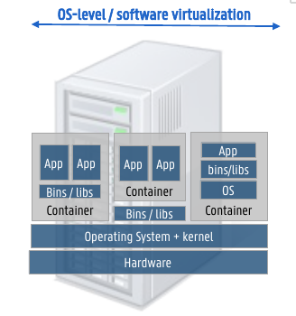

# Summary DevOps

## 1. What is DevOps?

Practice of operations and development engineers participating *together* in the entire service lifecycle from design through development to production support. Whit the goal of improving and shortening the systems development lifecycle.


### Traditional development teams (before DevOps)

- Development teams
  - Requirement analysis
  - Software design
  - Planning
  - Software implementation
  - Testing
- Operation teams
  - Receives application from dev team
  - Deploy app on infrastructure
  - Manage infrastructure
  - Monitoring
  - Support

This approach led to a lot of *operation mismatch*:

- Defects released to production
- Hard to diagnose issues quickly
- Finger pointing
- ...

### DevOps core values

1. Culture and People > Process and tools
    - Poeple become product owners, give them trust and responsibility
2. Automation (infrastructure as code)
    - Automation is critical as things need to move fast
3. Measurement (measure everything)
    - Knowledge of system is key
    - Know when and why things go wrong
4. Sharing - collaboration - feedback
    - Sharing knowledge between Devs and Ops

### Continuous delivery/deployment

- **Continuous integration**: build and test
- **Continuous delivery**: deploy and integration test
- **Continuous deployment**: build, test, deploy, integration test and deploy to prod

> 💡: Best practices
>
> - Build should pass within 5 min (☕ coffee test)
> - Commit small bits
> - Do not leave build broken
> - Deployment should go to a copy of production (🚧 staging) before production


#### Automated testing for continuous deployment

- Unit tests: Test individual components of code
- Integration tests: Test how components work together
- Crossbrowser, performance, security tests

### CI/CD Tooling

- **Version control**: Git, BitBucket
- **CI systems**: Jenkins, TravisCI 
- **Build**: Make, Maven, Packer
- **Test**: Junit, Cucumber
- **Artifact repository**: Dockerhub, Artifactory
- **Deployment**: Ansible

### Reliablility Engineering

The goal is to have no down-time, design patterns exist for creating resilient systems.

The key is to: Build - Measure - Learn - Repeat!

#### Chaos Engineering

Chaos Engineering is a discipline that aims to proactively test and improve a system's resilience to unexpected and turbulent conditions. It involves deliberately introducing controlled and planned disruptions into a software or system environment to observe how the system responds under stress.

**Chaos monkey**
: Introduce random failures in production and see how resilient system is, or how fast ingeneers can act upon this problem.

### DevSecOps

Extension of DevOps that includes security from the get-go

- **Secure Coding**: Responsibility of the devs to write secure code.
- **Security testing tools integrated in CI/CD pipeline**: eg. scanning dependencies/containers for vulnerabilities
- **Shift-left testing**: Software testing is pefromed earlier in lifecycle.

#### Tools to implement DevSecOps

- **SAST - Static Applicaiton Security Testing**
  - Scan proprietary/custom code for erros
  - During the code, build and dev phases of the lifecycle
- **SCA - Software Component Analysis**
  - Scan source code and libraries for known vulnerabilities
  - Provide insight of security and licence risks
  - Integrates seamlessly into CI/CD pipeline
- **IAST - Interactive Application Security Testing**
  - Work in the background during tests to analyze runtime behavior
  - Observe request/response integration
  - Detect runtime vulnerabilities
- **DAST - Dynamic Application Security Testing**
  - Automated black box testing -> mimic how hacker would approach your system

## 2. Container Technology

### 2.1 Virualisatoin: VM's and containers

**Why is there a need to containerize testing and deployment?**

- Operation teams must set-up a variety of different runtime engines, deal with versionning, ...
- No ability to constrain resources consumed by a single service instance
- Lack of isolation between multiple instances on the same machine


#### Virtual Machine Images

- ✅: Encapsulation and isolation
- ✅: Virtual hardware
- ❌: Less efficient resource utilization
- ❌: Slow deployments

#### Host Virtualization: Vurtual Machines and Containers

**Hardware virtualization**
: Hypervisor arbitrates access to shared hardware. VM's are completely isolated, each VM requires its own  OS



**Sofware virtualization**
: OS kernel allows multiple process spaces. Containers share the host OS kernel, each container has its own root file system.



#### Container as deployable artifact


- Encapsulation
- Isolation
- Resource contraints
- No virt hardware
- lightweight
- fast boot

### 2.2 Container Technologies

#### LXC/LXD

**LXC**:
Containers build into the Linux kernel. Low-level and difficult to configure.

**LXD**:
Next generation, build on top of LXC, locked in the Canonical ecosystem.

#### Docker

- Can be thought of as a software logistics provider tool (installing, removeing, upgrading and running software)
- Docker CLI + Deamon
  - Builds images, runs and manages containers + REST API
  - Containers can only access their own memory and resources


Container = software that has to get started

Container-image = All the configuration necessary to start the container

##### Handling application dependencies

Without containers, application use the same dependencies (the ones located on the host computer). This can become problematic if different applications require different versions of the dependencies.

When using docker, every container will have it's own copy of the required dependencies.

##### Namespaces / Environment independence

- Every running program or container has a unique *PID*
- PID namespace is set of unique numbers that identify processes
  - Host can have multiple PID namespaces
  - Each PID namespace contains its own PID's
  - Docker created new PID namespace for each container
- Docker provides **environment independence**
  - Within docker, you can run everything independent of other processes on the computer (eg: you don't have to care about existing PID's or other open ports on system)
 
#####  Environment-Agnostic

1. Read-only file systems
    - Attacker can not compromise files in the container
    - Confidence container will not change after changes to the files it contains
2. Environment variable injection
    - Docker `env` command can be used to inject variables (like credentials) into the container
3. Volumes

##### Container states


##### OS layers in containers

**Why is there an OS-layer in a docker container**
: Containers contain a very minimalistic version of an OS. This layer is called the `Base Layer`. This layer contains essentials to run the application (like a file system, network, ...). Developers can choose which Base they want (centos, busybox, scratch, ...)

Windows hosts can also have an additional layer for a hypervisor, in this case, every container receives its own Hyper-V kernel.


> 💡: Containers with Hyper-V are also a bit safer. When an attacker gets access to the kernel, it will only access the virtual Hyper-V kernel.

##### Building container with Dockerfile

Containers can be made using a `Dockerfile` configuration file

```txt
FROM ubuntu:14.04       // Base image

COPY html /var/www/html // Copy files from host to container
ADD web-page-config.tar // Similar to COPY bur for tar and remote URL

ENV APACHE_LOG_DIR /var/log/apahce    // Set env varialbe
USER 73                 // Set userid in the image

EXPOSE 7373/udp 8080    // Expose network ports

RUN apt update -y       // Run bash command
ENTRYPOINT ["echo", "Dockerfile demo"]  // Run when container starts
```

##### Container vs Image

When starting a container from an image, Docker engine will add another layer. This layer will store information added to the container while it was running. If container gets restarted this information will be gone again.

##### Union file system

Some layers in a docker image (like the base layers) have their own read-only file-system. On top of that, Docker Engine adds another read-write file-system when building the container. These different layers get merged into one virtual layer (= **UnionFS**).


**Copy-on-write**
: Only copy file to upper layer that have been modified, this reduces space and startup time.

### 2.3 Container Management/Orchestration

**What does an orchestration framework do?**

It automates deployment, interconnection, scaling and maintenance of multiple containers on a cluster of nodes.

Some container orchestration systems:

- Kubernetes
- Docker orchestration
- Amazon EC2

### 2.4 Container Ecosystem Discussion

#### Low-level

- **Low-level runtime**:
  - Can: spin up a container and connect it to existing network
  - Can't: create network, manage images, prepare environment for container and manage local/persistent storage

- Main approaches (OCI runtime-spec compatible)
  - runc: cli tools for spanning and running OS-level virt container
  - kata-runtime: cli tool for spanning hardare-virt container (focus: security)

#### High-level runtime

**High-level runtime**: deals with creating the network, managing images, perparing environment, and managing local/persistent storage

- Main approaches (CRI-compatible)
  - Containerd: controlled by CNCF
  - CRI-O: bridge between Kubernetes and OCI-compliant runtimes by RedHat (default in OpenShift)
  - Docker

#### High-level management

**High-level container management**: deals with orchestrating containers on infrastructure

- Main approaches:
  - Kubernetes (*de-facto*)
  - Docker
  - Podman (RedHat)


#### Conclusion

- Container: go-to for micro-services
  - Rapid scaling
  - lightweight
  - Can run anywhere
- Container tech options
  - Dockerfiles
  - Docker compose
- Container orchestration
  - Kubernetes is the de-facto standard
- Fractured ecosystem

---

